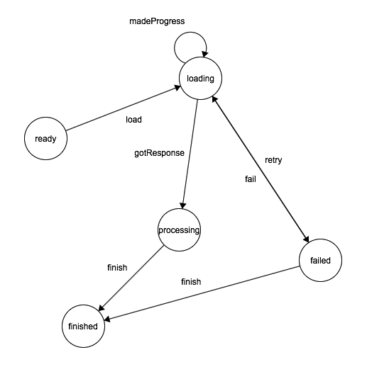

# automat

Interactive web tool for generating Swift state machine code by drawing a state diagram.

This version is usable, but the project is still in its infancy.

Access the tool directly in your web browser here: https://apparata.github.io/automat

## Example



The diagram above would result in a state machine with generated state and event enums in Swift. It could be used in the following way:

```
let stateMachine = StateMachine(initialState: .ready)

stateMachine.didTransition = { from, event, to in
    // This is where you would act on transitions.
     print("\(from) -\(event)-> \(to)")
}

// Trigger a transition to the .loading state from the .ready state.
stateMachine.fire(event: .load)
```
